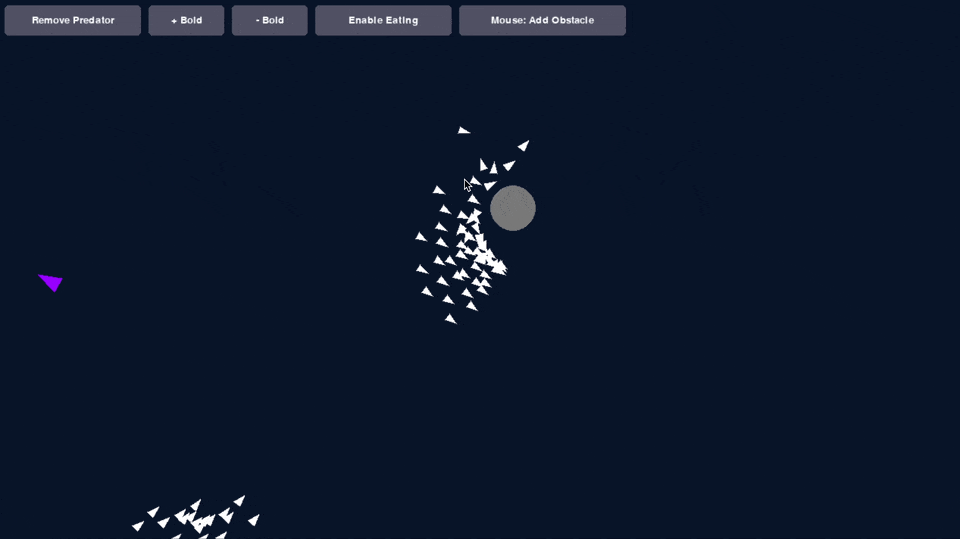

This is a learning project.

# Boids Simulation

This project is a Python-based simulation inspired by the Boids algorithm, which models the flocking behavior of birds. The simulation is built using the Pygame library and features interactive elements that allow you to experiment with the Boids' world.



## Features

*   Boids Flocking: Witness the mesmerizing emergent behavior of flocking creatures.
*   Predators: Introduce a predator to observe its impact on the boids.
*   Interactive Obstacles: Add or remove obstacles to shape the environment.
*   Dynamic Controls: Adjust the simulation in real-time with UI buttons.

## Getting Started

### Prerequisites

*   uv

### Installation

Clone the repository:
```bash
git clone https://github.com/your-username/boids-demo.git
```

### Running the Simulation

Execute the `main.py` script to start the simulation:

```bash
uv run  main.py
```

## How to Use

### UI Buttons

The simulation provides several buttons to control the environment:

*   Add/Remove Predator: Toggles the presence of a predator in the simulation.
*   + Boid: Adds a new boid to the flock.
*   - Boid: Removes a random boid from the flock.
*   Enable/Disable Eating: Toggles the predator's ability to eat boids.
*   Mouse: Add/Remove Obstacle: Switches the mouse's function between adding and removing obstacles.

### Mouse Controls

*   Add Obstacle Mode: Click anywhere on the screen to add a circular obstacle.
*   Remove Obstacle Mode: Click on an existing obstacle to remove it.

### Key Bindings

*   ESC: Quit the simulation.

---

This project was developed in collaboration with Gemini.